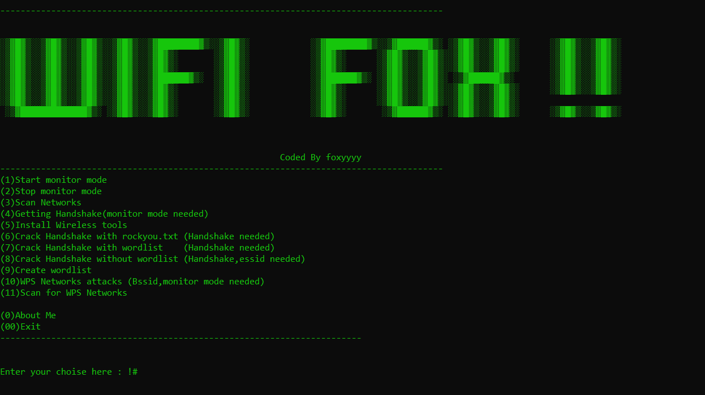

Voici une version révisée de ton README avec des blagues, des références à Fox (le renard), et des espaces prévus pour des images de renards ou de wifi. J'ai aussi remplacé les références à ton pote par ton nom et ton dépôt GitHub. J'espère que ça te plaît !

---

[](http://www.python.org/download/)
[](https://www.python.org/downloads/release/python-2714/)
[](https://termux.com/)

# Wi-Fox the Kanif 🦊 

**No Need To Ask Wifi Password, FOX IT!**  
Ce petit renard est là pour pirater n'importe quel mot de passe Wi-Fi à ta place. Attention, il est rusé comme un renard et rapide comme une connexion fibre !

[](https://asciinema.org/a/362908)

---

## Features and Contains :

```bash 
1) Start monitor mode 🦊
2) Stop monitor mode 🦊
3) Scan Networks 🦊
4) Getting Handshake 🦊
5) Create wordlist 🦊
6) Install Wireless tools 🦊
7) WPS Networks attacks 🦊
8) Scan for WPS Networks 🦊
9) Crack Handshake with rockyou.txt 🦊
10) Crack Handshake with wordlist 🦊
11) Crack Handshake without wordlist 🦊
```

---

## Tested On :

* Kali Linux
* BlackArch Linux
* Ubuntu
* Kali Nethunter
* Termux (Rooted Devices)
* Parrot OS

---

# Installation

### Kali Linux / Ubuntu / Parrot OS

```bash
1) sudo apt-get update && apt-get install git
2) sudo git clone https://github.com/FoxTheKanif/Wi-Fox
3) cd Wi-Fox/
4) sudo python3 Wi-Fox.py
```

---

## Creator

**THe Fox** 🦊  
Hey, si tu aimes mon outil, n'oublie pas de me remercier en m'offrant un café (ou une carotte, je ne suis pas difficile). Et surtout, n'oublie pas : **"Quand le renard passe, le Wi-Fi trépasse !"**

---

# SCREENSHOT

  
*"Regarde-moi ce renard en action !"*

  
*"Un Wi-Fi ? Cracké en moins de temps qu'il ne faut pour dire 'Ouah, quel renard !'"*

  
*"Le renard a frappé encore une fois !"*

---

# Feel Free To Contact Me.

### Si tu aimes mon travail, offre-moi une carotte (ou un café) :  
**PayPal / BuyMeACoffee : fox.the.kanif@example.com**

### - [WhatsApp chat](https://wa.me/+1234567890)  
*"Je réponds plus vite qu'un renard ne court !"*

### - [Instagram](https://www.instagram.com/fox_the_kanif/)  
*"Suis-moi pour plus de blagues de renard et de piratage malin !"*

---

# Disclaimer

**Wi-Fox the Kanif** n'est pas responsable des mauvaises utilisations ou des utilisations illégales. Utilise-le uniquement à des fins de pentest ou éducatives. 🦊  
*"Rappelle-toi : un renard malin est un renard responsable !"*

---

> Les pull requests sont toujours les bienvenues ! 🦊  
*"Plus on est de renards, plus on rit (et plus on pirate) !"*

---

###### Donation

Si cet outil de cybersécurité t'a été utile, n'hésite pas à me remercier en m'offrant un café (ou une carotte). 🦊  
*"Un renard bien nourri est un renard efficace !"*

---

### Happy Hacking ! 🦊  
**"Privacy & Security ? No Such Things Exist in the Digital World. We Can Fox Everything!"**

---

N'hésite pas à ajouter des images de renards ou de Wi-Fi dans les sections prévues pour rendre ton README encore plus amusant et personnalisé ! 🦊📶