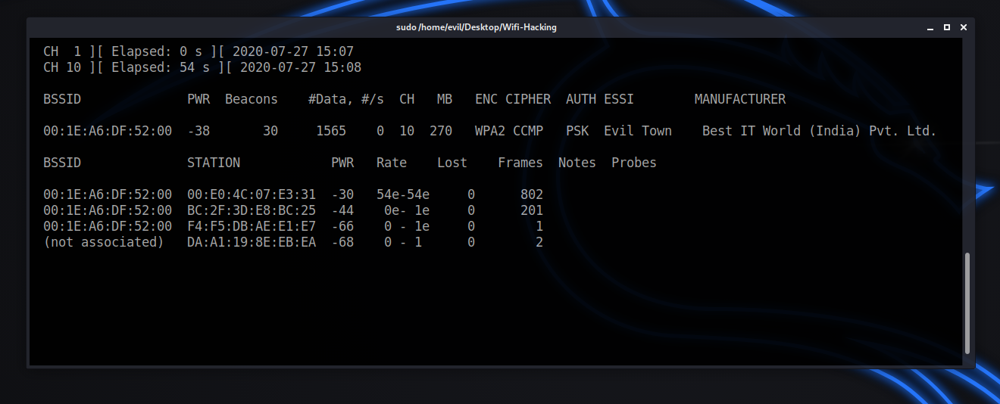
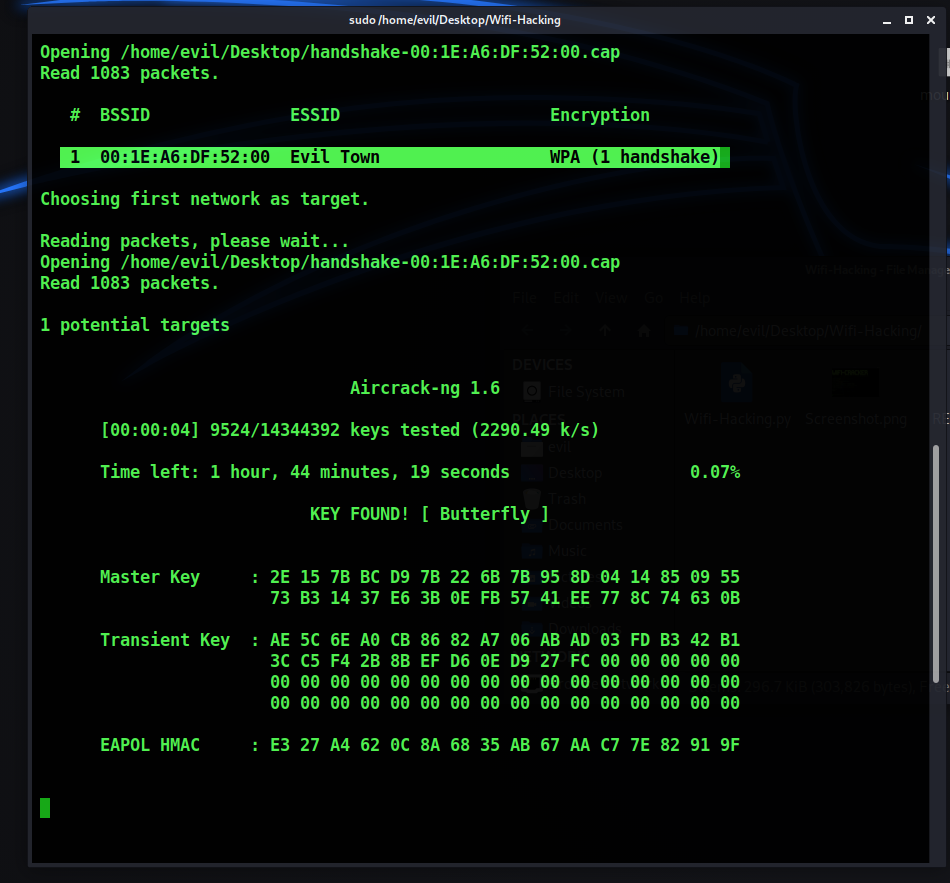

[](http://www.python.org/download/)
[](https://www.python.org/downloads/release/python-2714/)
[](https://termux.com/)

# Wi-Fox the Kanif  

**No Need To Ask Wifi Password, FOX IT!**  
Ce petit renard est là pour pirater n'importe quel mot de passe Wi-Fi à ta place. Attention, il est rusé comme un renard et rapide comme une connexion fibre !

[](https://asciinema.org/a/362908)

---

## Features and Contains :

```bash 
1) Start monitor mode 🦊 
2) Stop monitor mode 🦊 
3) Scan Networks 🦊 
4) Getting Handshake 🦊 
5) Create wordlist 🦊 
6) Install Wireless tools 🦊 
7) WPS Networks attacks 🦊 
8) Scan for WPS Networks 🦊 
9) Crack Handshake with rockyou.txt 🦊 
10) Crack Handshake with wordlist 🦊 
11) Crack Handshake without wordlist 🦊 
```

---

## Tested On :

* Kali Linux
* BlackArch Linux
* Ubuntu
* Kali Nethunter
* Termux (Rooted Devices)
* Parrot OS

---

# Installation

### Kali Linux / Ubuntu / Parrot OS

```bash
1) sudo apt-get update && apt-get install git
2) sudo git clone https://github.com/Tiger-Foxx/Wi-Fox.git
3) cd Wi-Fox/
4) sudo python3 Wi-Fox.py
```

---

## Creator

**THe Fox** 🦊   
Hey, si tu aimes mon outil, n'oublie pas de me remercier en m'offrant un café (ou une carotte, je ne suis pas difficile). Et surtout, n'oublie pas : **"Quand le renard passe, le Wi-Fi trépasse !"**

---

# SCREENSHOT

  
*"Regarde-moi ce renard en action !"*

  
*"Un Wi-Fi ? Cracké en moins de temps qu'il ne faut pour dire 'Ouah, quel renard !'"*

  
*"Le renard a frappé encore une fois !"*

---

# Feel Free To Contact Me.

### - [WhatsApp chat](https://wa.me/+237658866639)  
*"Je réponds plus vite qu'un renard ne court !"*

### - [Instagram](https://www.instagram.com/i_am_the_fox_coder/)  
*"Suis-moi !"*

---

# Disclaimer

**Wi-Fox the Kanif** n'est pas responsable des mauvaises utilisations ou des utilisations illégales. Utilise-le uniquement à des fins de pentest ou éducatives. 🦊   
*"Rappelle-toi : un renard malin est un renard responsable !"*

---

> Les pull requests sont toujours les bienvenues ! 🦊   
*"Plus on est de renards, plus on rit (et plus on pirate) !"*

---

###### Donation

Si cet outil de cybersécurité t'a été utile, n'hésite pas à me remercier en m'offrant un café (ou une carotte). 🦊   
*"Un renard bien nourri est un renard efficace !"*

---

### Happy Hacking ! 🦊   
**"Privacy & Security ? No Such Things Exist in the Digital World. We Can Fox Everything!"**

